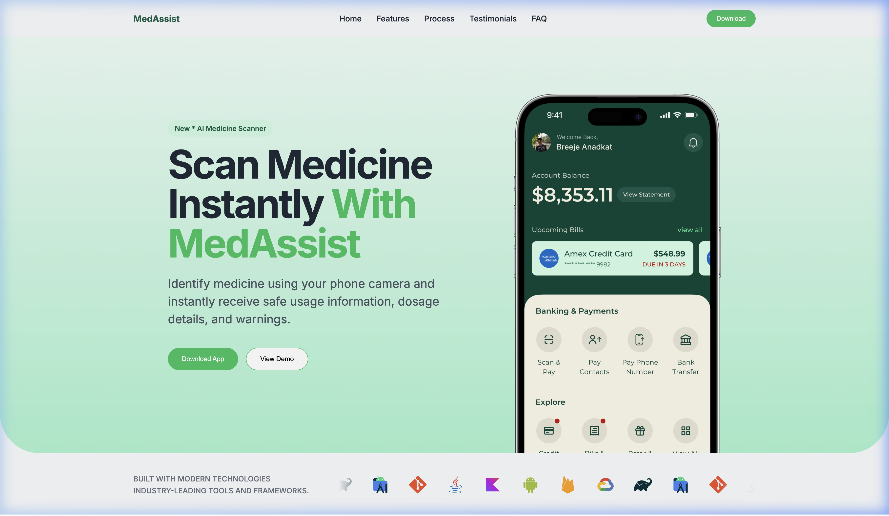

# 💊 MedAssist — Landing Page


A modern, responsive landing page for **MedAssist**, an AI-powered medicine scanning mobile application. Built with clean HTML, CSS, and JavaScript — designed to deliver a premium, professional first impression.



---

## ✨ Features

- **Hero Section** — Bold typography with a dynamically positioned phone mockup that overflows the section boundary with rounded corners for a sleek, modern look
- **Responsive Navigation** — Clean navbar with logo, navigation links, and a CTA download button
- **Tech Stack Marquee** — Infinite horizontal scrolling animation showcasing the technologies used to build MedAssist
- **Viewport-Optimized Layout** — Hero and tech stack sections are precisely sized to fit within a single viewport across all modern browsers (Chrome, Arc, Safari, Firefox)

---

## 🛠️ Tech Stack (Website)

| Category     | Technology         |
|--------------|--------------------|
| Structure    | HTML5              |
| Styling      | Vanilla CSS        |
| Animation    | JavaScript (ES6+)  |
| Typography   | Google Fonts (Inter) |
| Icons        | Devicons CDN       |

---

## 🏗️ Tech Stack (MedAssist App)

| Category       | Technology                  |
|----------------|-----------------------------|
| Language       | Java / Kotlin               |
| Framework      | Android SDK                 |
| Backend        | Firebase Authentication     |
| Database       | Firebase Firestore          |
| AI             | Google Gemini API           |
| OCR            | Google ML Kit               |
| Camera         | Android CameraX             |
| Networking     | OkHttp                      |
| Architecture   | Gradle Android Project      |
| IDE            | Android Studio              |

---

## 🚀 Getting Started

### Prerequisites
- Any modern web browser (Chrome, Arc, Safari, Firefox)
- [Node.js](https://nodejs.org/) (optional, for live-server)

### Run Locally

1. **Clone the repository**
   ```bash
   git clone https://github.com/Its-Nahid/MedAssist-LandingPage.git
   cd MedAssist-LandingPage
   ```

2. **Open directly**
   Simply open `index.html` in your browser.

3. **Or use live-server** (recommended for development)
   ```bash
   npx -y live-server . --port=8080
   ```

---

## 📁 Project Structure

```
MedAssistWebsite/
├── assets/             # Images and media files
│   └── screenshot.png
├── index.html          # Main HTML structure
├── styles.css          # All styles and animations
├── scripts.js          # Infinite scroll logo animation
└── README.md           # This file
```

---

## 🎨 Design Highlights

- **Gradient Hero** — Smooth green gradient (`#ecfdf5` → `#a7f3d0`) with rounded bottom corners
- **Half-Hidden Phone** — App mockup intentionally overflows the hero boundary, clipped by `overflow: hidden` with `border-radius` for a premium effect
- **Infinite Logo Scroll** — `requestAnimationFrame`-based smooth animation with precise seamless looping (no visible cuts)
- **Viewport Fit** — Uses `min-height: calc(100vh - 200px)` to ensure the entire page fits in one screen
- **CSS Masking** — Fade-in/fade-out edges on the logo marquee using CSS `mask-image` gradients

---

## 👨‍💻 Author

**Nahid**

[](https://github.com/Its-Nahid)

---

## 📄 License

This project is open source and available under the [MIT License](LICENSE).

---

<p align="center">
  Made with 💚 for MedAssist
</p>
